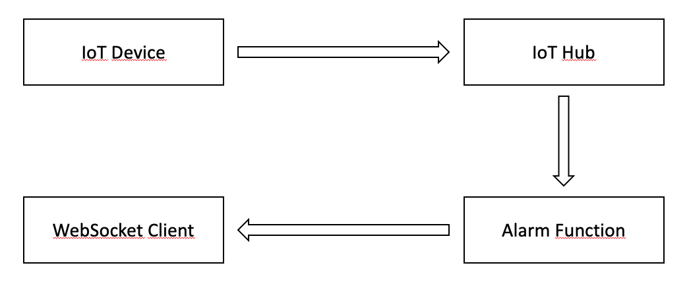

# Portia Test  

This sample includes an alarm function that will push a web socket message to a client when a certain precondition on an iot message is met.

## Set Up

1. Create an IoT Hub
2. Set an environment variable called _ServiceCS_ set to the service connetion string of the IoT Hub
3. Provision a device in IoT Hub. Set an environment variable called _DeviceCS_ set to the connetion string of the device
4. Set an environment variable called _WSPORT_ set to a port where web socket communitacion will occur
5. Clone this repo 
6. Start the **alarm_server** script on Azure. You can do that on a VM (remember to open the port used for the web socket communication) or using **Azure Container Instance** (you can pull an image from _docker pull lucarv.azurecr.io/alarmserver:0.0.1_) and running the script on a container. 
7. Start the **alarm_client** script on the same computer or an computer that have the clock synchronized with the alarm server clock
8. Start the device simulator script (device.js)

## What will happen  

The alarm server subscribes to the default endpoint in IoT Hub and will receive all telemetry.  
The device simulator will send telemetry in 5 seconds interval, reporting an increase in temperature. When the temperature reaches a threshold, the alarm server will send a web socket message to the alarm client. This message contains a timestamp that was created when the message was generated on the device simulator.  
When the alarm client receives the alarm, it will display the elapsed time from message generated on device to message received in alarm client, in miliseconds.  
The alarm client will wait 10 seconds and clear the alarm, and things will repeat nicely in a loop until the scripts exit.

